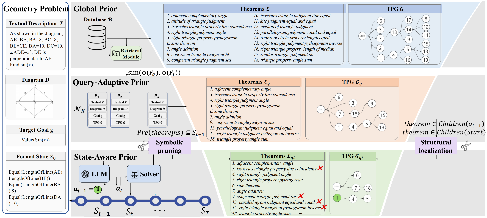

<div align="center">

## *On Multi-Step Theorem Prediction via Non-Parametric Structural Priors*

<p align="center">
  
  
</p>

<p align="center">
  <a href="https://arxiv.org/pdf/2603.04852">📄 Paper</a> •
  <a href="#-quick-start">🚀 Quick Start</a> •
  <a href="#-full-pipeline">⚙️ Full Pipeline</a> •
  <a href="#-citation">📚 Citation</a>
</p>

</div>

---

## 🎉 Announcement

**🏆 This paper has been accepted at ICML 2026!** 🎉

We're excited to share our training-free theorem prediction framework with the community!

---

## 👥 Authors

<div align="center">

**Junbo Zhao** • **Ting Zhang** • **Can Li** • **Wei He** • **Jingdong Wang** • **Hua Huang**<sup>✉</sup>

</div>

---

## 📖 Overview

**Pri-TPG** is a **training-free** theorem prediction framework for automated geometry reasoning. It identifies **structural drift** in vanilla in-context learning — where theorem prediction degrades rapidly as the search space grows — and introduces **Theorem Precedence Graphs (TPGs)** to inject explicit structural priors during inference.

Combined with retrieval-augmented graph construction and a stepwise symbolic executor, Pri-TPG guides LLMs as structured planners **without any gradient-based optimization**. On FormalGeo7k, it achieves **89.29% accuracy**, matching or outperforming strong supervised baselines.

<div align="center">
  
  <br>
  <em>🔺 Framework Overview of Pri-TPG &nbsp;</em>
</div>

---

## 🔍 Key Features

<div align="center">

| Component | Description |
|-----------|-------------|
| 📉 **Structural Drift** | We show that theorem prediction degrades rapidly as the search space grows in vanilla ICL |
| 🧭 **Structural Prior** | Pri-TPG extracts query-specific priors from historical solution traces via Theorem Precedence Graphs |
| 🏆 **SOTA Performance** | 89.29% accuracy on FormalGeo7k — competitive with state-of-the-art supervised methods |
| 🚫 **Training-Free** | No gradient-based optimization; works purely via retrieval + structured planning |

</div>

---

## 🏗️ Built On

<div align="center">

This codebase is built on the excellent [FormalGeo](https://github.com/FormalGeo/FormalGeo) project.

[](https://github.com/FormalGeo/FormalGeo)

</div>

---

## 📥 Installation

```bash
# Clone the repository
git clone https://github.com/your-org/Pri-TPG.git
cd Pri-TPG

# Editable install (one command)
pip install -e .
```

> FormalGeo is bundled under `src/formalgeo` — no extra install needed.

---

## 📊 Dataset Preparation

> ⚠️ `datasets/formalgeo7k_v2/` is **NOT** included in this repository.

Download the FormalGeo dataset from the official source:

<div align="center">

| Resource | Link |
|----------|------|
| 📐 **FormalGeo Dataset** | [Download](https://github.com/FormalGeo/FormalGeo) |

</div>

After downloading, extract/copy so the local path is exactly:

```
datasets/formalgeo7k_v2/
```

---

## 🚀 Quick Start

### ✅ Step 1 — Verify Installation

```bash
python -c "import formalgeo; print('formalgeo ok:', getattr(formalgeo, '__version__', 'loaded'))"
```

### ⚡ Step 2 — Replay Mode (No API Required)

```bash
python -m solve.main --quick-start true --max-problems 1
```

> Uses the default replay file: `output_solver_runs/GPT_5_2.json`

---

## ⚙️ Full Pipeline

> ⚠️ **API Cost Notice**: The full pipeline calls both an LLM API (GPT-5-mini) and an embedding API (Jina Embeddings v4). Processing the full FormalGeo7k dataset may incur **significant API charges**. We recommend starting with `--quick-start true` (replay mode, zero cost) or testing on a small subset first.

<details open>
<summary><b>🔑 Step 1 — Configure API Keys</b></summary>

```powershell
$env:OPENAI_API_KEY  = "YOUR_KEY"
$env:OPENAI_BASE_URL = "YOUR_BASE_URL"
$env:OPENAI_MODEL    = "gpt-5-mini"

$env:EMBEDDING_API_KEY = "YOUR_KEY"
$env:EMBEDDING_API_URL = "YOUR_BASE_URL"
$env:EMBEDDING_MODEL   = "jina-embeddings-v4"
```

</details>

<details open>
<summary><b>🧠 Step 2 — Build RAG Embedding Store</b></summary>

```bash
python RAG/create_RAG_base.py \
  --mode text-image-en \
  --split train \
  --limit 5000 \
  --model $env:EMBEDDING_MODEL \
  --api-key $env:EMBEDDING_API_KEY \
  --api-base $env:EMBEDDING_API_URL
```

> Keep `--mode` consistent between embedding store creation and inference.

</details>

<details open>
<summary><b>🚀 Step 3 — Run Inference</b></summary>

```bash
python -m solve.main \
  --quick-start false \
  --retrieval-mode text-image-en \
  --embedding-model $env:EMBEDDING_MODEL \
  --top-k 200
```

</details>

**Outputs** are written to `output_solver_runs/`.

---

## 📚 Citation

If you find our work helpful, please consider citing:

```bibtex
@inproceedings{Pri-TPG,
    title     = {On Multi-Step Theorem Prediction via Non-Parametric Structural Priors},
    author    = {Zhao, Junbo and Zhang, Ting and Li, Can and He, Wei and Wang, Jingdong and Huang, Hua},
    booktitle = {Proceedings of the International Conference on Machine Learning (ICML)},
    year      = {2026}
}
```
</div>
